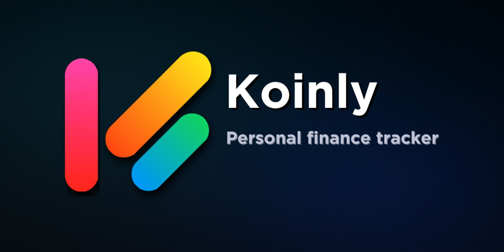

<p align="center">
  
</p>

# Koinly

<p align="center">
  <a href="https://flutter.dev"></a>
  <a href="https://github.com/Chowdhury-Siam/Koinly/actions/workflows/build-android-apks.yml"></a>
  
  <a href="LICENSE"></a>
</p>

<p align="center">
  A private, local-first personal finance app for Android and Windows.<br>
  Use it completely offline, or connect your own Cloudflare Worker for optional multi-device sync.
</p>

## Quick navigation

| Start here | Self-hosted sync | App & backups | Developers |
| --- | --- | --- | --- |
| [1. What is Koinly?](#what-is-koinly)<br>[2. Features](#features)<br>[3. Getting started](#getting-started) | [4. What self-hosted sync means](#optional-self-hosted-sync)<br>[5. Deploy your Worker](#deploy-your-self-hosted-worker)<br>[6. Connect Koinly](#connect-koinly-to-your-worker)<br>[7. Telegram backups](#optional-telegram-cloud-backup) | [8. Automatic local backup](#automatic-local-backup)<br>[9. Data safety](#data-safety-and-security)<br>[12. Troubleshooting](#troubleshooting) | [10. Build from source](#build-from-source)<br>[11. Worker development](#worker-development)<br>[13. Project structure](#project-structure)<br>[14. License](#license) |

---

<a id="what-is-koinly"></a>
## 1. What is Koinly?

Koinly is a personal finance tracker designed to keep your data under your control.
Your accounts, transactions, categories, budgets, loans, plans, and other finance data are saved to a local SQLite database first.

You **do not need an account or server to use Koinly**. Install the app, choose **Use offline**, and start tracking your money.

If you want the same data on multiple devices, Koinly also supports **self-hosted sync**. You create a small Cloudflare Worker connected to your own Turso database, then enter the Worker URL in the app.

### 1.1 In simple terms

- **Koinly app** = the finance app on your phone or PC.
- **Cloudflare Worker** = your small private sync server.
- **Turso** = the database used by that sync server.
- **GitHub Actions** = automatically deploys the Worker for you.

You do not need to write Cloudflare or Turso code yourself.

<a id="features"></a>
## 2. Features

### 2.1 Personal finance

- Multiple cash, bank, card, savings, and custom accounts
- Income, expense, and transfer transactions
- Single dates/times or optional start/end ranges
- Custom income and expense categories
- Monthly budgets and progress tracking
- Lending and borrowing with repayments, interest, due dates, and timestamps
- Purchase planning with item name, expected price, category, total planned cost, editing, and one-tap purchase conversion
- Cash-flow trends, category analysis, balances, and net results
- Search and filters for account, category, type, and date
- Quick account/category creation from transaction pickers

### 2.2 Backup and restore

- Encrypted `.koinlybackup` files
- Merge-based restore instead of destructive replacement
- Automatic category deduplication while restoring or syncing
- Restore-or-Start-New onboarding
- Automatic local backups on a daily, weekly, or monthly schedule
- User-selected Android backup folder using the system folder picker
- Optional deletion of the previous automatic backup after a new backup succeeds
- Privacy-safe diagnostics in **Advanced settings > Data health**

### 2.3 App experience

- Material 3 design
- Light, dark, and system themes
- Android and Windows layouts
- Spring-based touch feedback and restrained elastic motion
- App-wide keyboard/focus dismissal for text and numeric fields
- Profile image/GIF/short-video media with repositioning, crop framing, and zoom
- Android reminders
- GitHub Releases update checks

### 2.4 Self-hosted sync

- Your own Cloudflare Worker and Turso database
- One owner account per Worker
- Username/password login from additional devices
- Recovery-key password reset without requiring an email address
- Offline-first local outbox
- Incremental push/pull synchronization
- Merge-first **Restore cloud copy** and **Upload local changes**
- Category deduplication across devices
- Version-based conflict handling
- Optional Telegram `.koinlybackup` delivery

---

<a id="getting-started"></a>
## 3. Getting started

### 3.1 Use Koinly without sync

This is the easiest option and requires no Cloudflare, Turso, or GitHub setup.

1. Install and open Koinly.
2. Tap **Use offline**.
3. Choose **Start New** to create a fresh local profile, or **Restore** to merge an existing `.koinlybackup` file.
4. Finish the setup screens and start using the app.

Everything stays on that device unless you later connect a self-hosted Worker.

### 3.2 Use Koinly on multiple devices

Set up the self-hosted Worker once, then use the same Worker URL and account on your other devices.

The full beginner-friendly deployment guide is below.

---

<a id="optional-self-hosted-sync"></a>
# 4. Optional self-hosted sync

Self-hosted sync is optional. It is only needed if you want your Koinly data synchronized through your own backend.

Before starting, you need:

- a GitHub account;
- a Turso account;
- a Cloudflare account; and
- a fork of this repository.

### 4.1 The six values you will create

You will add these names to **GitHub > Settings > Secrets and variables > Actions**:

| Name | What it is | Where it comes from |
| --- | --- | --- |
| `CLOUDFLARE_NAME` | Your Worker name, such as `my-koinly-sync` | You choose it |
| `CLOUDFLARE_API_TOKEN` | Lets GitHub deploy your Worker | Cloudflare |
| `CLOUDFLARE_ACCOUNT_ID` | Identifies your Cloudflare account | Cloudflare |
| `TURSO_DATABASE_URL` | Your `libsql://...turso.io` database address | Turso |
| `TURSO_AUTH_TOKEN` | Read/write access token for the Turso database | Turso |
| `JWT_SECRET` | Long random secret used by your Worker | You generate it |

Keep the token/secret values private. Never post them in issues, screenshots, chats, logs, or source files.

---

<a id="deploy-your-self-hosted-worker"></a>
# 5. Deploy your self-hosted Worker

The normal setup is:

```text
Fork Koinly on GitHub
        ↓
Create a Turso database
        ↓
Create a Cloudflare API token
        ↓
Add 6 values to GitHub Actions
        ↓
Run "Deploy Self-Hosted Sync Worker"
        ↓
Copy the workers.dev URL
        ↓
Paste it into Koinly
```

## 5.1 Step 1 — Fork Koinly

1. Open this repository on GitHub.
2. Click **Fork** in the upper-right corner.
3. Create the fork under your GitHub account.
4. Open your new fork.

The deployment workflow runs from your fork, so you do not need to edit Worker source code.

## 5.2 Step 2 — Create your Turso account and database

Turso stores the synchronized copy of your Koinly data.

1. Go to **https://app.turso.tech/**.
2. Create an account or sign in.
3. Open **Databases**.
4. Click **Create Database**.
5. Keep **New Database** selected.
6. Enter a simple name such as `koinly`.
7. Leave the normal/default group selected unless you specifically need another one.
8. Click **Create Database**.

### 5.2.1 Copy the Turso database URL

After the database is created:

1. Open the database.
2. Open its **Overview** page.
3. Find **Connect**.
4. Copy the **Database URL**.

The correct value looks similar to:

```text
libsql://koinly-yourname.turso.io
```

Add it to GitHub later as:

```text
TURSO_DATABASE_URL
```

> **Important:** Do not copy the normal `https://app.turso.tech/...` browser address. Koinly needs the `libsql://...turso.io` database URL shown under **Connect**.

### 5.2.2 Create the Turso token

In the current Turso dashboard shown in the setup recording:

1. Open your database **Overview** page.
2. In the **Connect** section, click **Create Token**.
3. Turso immediately opens a **Token Created** dialog.
4. Copy the long token from the first field. This is your `TURSO_AUTH_TOKEN`.
5. The same dialog also shows the `libsql://...turso.io` database URL. You can copy it there as a second check for `TURSO_DATABASE_URL`.
6. Save the token before closing the dialog because the full token is not shown again later.

If Turso adds an authorization/permission choice in a future dashboard version, the Worker needs normal **read and write** database access. Do not enable **Block Reads** or **Block Writes** on the database.

### 5.2.3 Optional Turso CLI method

The web dashboard is recommended for most users. If you already use the Turso CLI, the equivalent commands are:

```bash
turso db create koinly
turso db show koinly --url
turso db tokens create koinly
```

## 5.3 Step 3 — Create your Cloudflare account

Cloudflare runs the Koinly sync Worker.

1. Go to **https://dash.cloudflare.com/**.
2. Create an account or sign in.
3. Select the Cloudflare account you want to use.

You do not need to buy or configure a domain for the normal Koinly setup. The deployment uses a `workers.dev` address.

## 5.4 Step 4 — Create the Cloudflare API token

1. In Cloudflare, open **Manage account > Account API tokens**.
2. Click **Create Token**.
3. Choose the **Edit Cloudflare Workers** template.
4. Give the token a recognizable name such as `koinly`.
5. In the policy, scope the token to the Cloudflare account that will host Koinly. **Do not use “Read all resources” or “Write all resources”, and do not select every permission group.** The Worker deployment does not need account-wide access to unrelated products.
6. Keep the permissions supplied by the **Edit Cloudflare Workers** template. The current template includes **Workers Routes Write**, **Workers Scripts Write**, **Workers KV Storage Write**, **Workers Tail Read**, **Workers R2 Storage Write**, **Account Settings Read**, **User Details Read**, and **User Memberships Read**. You do **not** need to manually turn every permission group into **Read & Write**.
7. Click **Review token**, then **Create token**.
8. On the **Token created successfully** dialog, copy **Your API Token** immediately. This is `CLOUDFLARE_API_TOKEN`.
9. The same success dialog shows **Account ID**. Copy that value too; it is `CLOUDFLARE_ACCOUNT_ID`.

The deployment workflow checks the values before running Wrangler. If Cloudflare changes the template later, recreate the token from the **Edit Cloudflare Workers** template rather than granting unrelated account-wide permissions.

## 5.5 Step 5 — Confirm your Cloudflare Account ID

The easiest place to copy the Account ID is the **Token created successfully** dialog shown immediately after creating the token. Use the Account ID from the same Cloudflare account that owns the Worker.

Copy it and add it to GitHub later as:

```text
CLOUDFLARE_ACCOUNT_ID
```

## 5.6 Step 6 — Choose a Worker name

Choose a short name such as:

```text
my-koinly-sync
```

Rules:

- lowercase letters, numbers, and `-` only;
- 1 to 63 characters;
- do not start or end with `-`.

Add the name to GitHub as:

```text
CLOUDFLARE_NAME
```

Your final address will look similar to:

```text
https://my-koinly-sync.<your-workers-subdomain>.workers.dev
```

The workflow prints the exact URL after deployment.

## 5.7 Step 7 — Create `JWT_SECRET`

`JWT_SECRET` protects Koinly login sessions and Worker-side encrypted secrets. It must be at least 32 characters long.

### 5.7.1 Easy option

Use a password manager's secure password generator and create a long random value.

### 5.7.2 OpenSSL option

```bash
openssl rand -hex 32
```

Add the generated value to GitHub as:

```text
JWT_SECRET
```

Do not reuse your Koinly password, GitHub password, Cloudflare password, or Turso token as `JWT_SECRET`.

## 5.8 Step 8 — Add the values to GitHub

Open your **forked Koinly repository**, then go to:

**Settings > Secrets and variables > Actions**

### 5.8.1 Add these as repository secrets

Open the **Secrets** tab and create:

```text
CLOUDFLARE_API_TOKEN
CLOUDFLARE_ACCOUNT_ID
TURSO_DATABASE_URL
TURSO_AUTH_TOKEN
JWT_SECRET
```

For each one:

1. Click **New repository secret**.
2. Enter the exact name shown above.
3. Paste the matching value.
4. Click **Add secret**.

### 5.8.2 Add the Worker name

For `CLOUDFLARE_NAME`, either:

- add it as a **repository variable** under the **Variables** tab (recommended); or
- add it as a repository secret.

Example:

```text
CLOUDFLARE_NAME = my-koinly-sync
```

### 5.8.3 Final checklist

Before deploying, your GitHub configuration should contain:

```text
CLOUDFLARE_NAME
CLOUDFLARE_API_TOKEN
CLOUDFLARE_ACCOUNT_ID
TURSO_DATABASE_URL
TURSO_AUTH_TOKEN
JWT_SECRET
```

Spelling matters. The workflow expects these exact names.

## 5.9 Step 9 — Deploy the Worker

1. Open the **Actions** tab in your fork.
2. If GitHub asks you to enable Actions for the fork, enable them.
3. Select **Deploy Self-Hosted Sync Worker**.
4. Click **Run workflow**.
5. Wait for the deployment job to finish.

The workflow automatically:

1. installs the Worker dependencies;
2. checks the Worker source;
3. runs Worker tests;
4. applies the Koinly schema to your Turso database;
5. uploads the Worker secrets securely;
6. deploys the Cloudflare Worker; and
7. checks that the deployed Worker is healthy.

When it succeeds, open the workflow run summary and copy the **Worker URL**.

Example:

```text
https://my-koinly-sync.example-subdomain.workers.dev
```

You do **not** need to manually create Turso tables. The workflow applies the schema for you.

---

<a id="connect-koinly-to-your-worker"></a>
# 6. Connect Koinly to your Worker

After deployment:

1. Open Koinly.
2. Go to **Settings > Account & sync**.
3. Paste your Cloudflare Worker URL.
4. Tap **Validate and use Worker**.
5. If this is a new Worker, choose **Create account** and enter a **username** and password. Koinly no longer asks for an email address.
6. After the account is created, Koinly shows a one-time **recovery key**. Copy it and store it somewhere safe before closing the popup.
7. On another device, use the same Worker URL and choose **Login** with the same username and password.

A fresh Worker accepts one owner account. After that account is created, additional devices use **Login** rather than creating another account. Usernames are 3–32 characters and may contain letters, numbers, dots, dashes, and underscores.

### 6.1 Forgot your password?

On the Login screen, choose **Forgot password?** and enter your username, saved recovery key, and a new password. A successful reset revokes the old refresh sessions and signs the current device in with the new password.

While signed in, **Settings > Account & sync > Recovery key** creates a replacement recovery key. The previous recovery key stops working immediately.

> Existing self-hosted databases created by older Koinly releases are migrated from email login to username login when the latest deployment workflow applies the schema. The old email's part before `@` becomes the initial username. Existing accounts do not have a recovery key until you sign in once and create one from **Recovery key**.

### 6.2 Sync controls

- **Upload local changes** merges your current local data into the Worker copy.
- **Restore cloud copy** downloads the Worker copy and merges it into the device.

Both are merge-based. Matching records are reconciled rather than blindly duplicated, while local-only and cloud-only records are preserved.

---

<a id="optional-telegram-cloud-backup"></a>
## 7. Optional Telegram cloud backup

Telegram backup is available only when using your self-hosted Worker.

In **Settings > Account & sync**, tap the bot icon in the upper-right corner.

You can configure:

- Telegram bot token;
- group or channel Chat ID;
- daily, weekly, or monthly upload schedule;
- exact delivery time;
- test delivery; and
- **Upload backup now**.

The Worker creates a `.koinlybackup` from the synchronized cloud data and sends it as a Telegram document.

For a Telegram channel, add the bot as an administrator with permission to post messages.

The saved bot token is encrypted by the Worker before it is stored in Turso.

---

<a id="automatic-local-backup"></a>
## 8. Automatic local backup

Open **Settings > Advanced settings > Automatic local backup**.

You can choose:

- daily, weekly, or monthly frequency;
- backup time;
- weekly day or monthly date;
- destination folder; and
- whether the previous automatic backup is deleted after a new one succeeds.

On Android, Koinly uses the system folder picker and creates/uses a `Koinly/Backup` folder under the selected location.

---

<a id="data-safety-and-security"></a>
## 9. Data safety and security

- Finance data is written to local SQLite first.
- Sync access and refresh tokens use platform secure storage.
- Turso credentials and `JWT_SECRET` stay on your Cloudflare Worker.
- The Flutter app does not contain your Turso or Cloudflare credentials.
- Sync requests are scoped to the signed-in owner account.
- Sync operations are versioned and designed to be idempotent.
- Local/cloud restore is merge-based.
- Backup imports reconcile equivalent categories to reduce duplicates.
- Telegram bot tokens saved for cloud backup are encrypted before Turso storage.
- Profile media remains device-local and is not part of finance synchronization.

---

<a id="build-from-source"></a>
# 10. Build from source

Most users do not need this section. It is for developers or people building Koinly themselves.

## 10.1 Requirements

- Flutter with Dart `>=3.5.0 <4.0.0`
- Android Studio / Android SDK 36 / Java 17 for Android
- Visual Studio with **Desktop development with C++** for Windows
- Node.js 22 for Worker development

## 10.2 Run locally

```bash
git clone https://github.com/Chowdhury-Siam/Koinly.git
cd Koinly
flutter pub get
flutter run
```

A Worker is not required for local/offline use.

## 10.3 Android build

```bash
flutter build apk --release \
  --no-tree-shake-icons \
  --dart-define=KOINLY_APP_VERSION=1.0.1080
```

## 10.4 Windows build

```bash
flutter build windows --release \
  --dart-define=KOINLY_APP_VERSION=1.0.1080
```

The GitHub release workflow reads the official version/build number from `pubspec.yaml`.

### 10.4.1 GitHub Actions

| Workflow | Purpose |
| --- | --- |
| `build-android-apks.yml` | Tests/builds Android APKs and Windows release artifacts |
| `deploy-sync-worker.yml` | Deploys a fork owner's self-hosted Cloudflare Worker |

### 10.4.2 Android signing

Release APK builds expect a permanent signing key through repository secrets. Keep the keystore and passwords outside the repository.

### 10.4.3 Windows signing

Windows code signing is optional. Without a signing certificate, the installer can still be generated, but Windows SmartScreen may show an unrecognized-publisher warning.

---

<a id="worker-development"></a>
## 11. Worker development

```bash
cd cloud/worker
npm ci
npm run typecheck
npm test
```

Apply the schema locally:

```bash
export TURSO_DATABASE_URL='libsql://your-db.turso.io'
export TURSO_AUTH_TOKEN='your-token'
npm run schema:apply
```

Manual deployment:

```bash
wrangler secret put TURSO_DATABASE_URL
wrangler secret put TURSO_AUTH_TOKEN
wrangler secret put JWT_SECRET
npx wrangler deploy --config wrangler.self-hosted.toml --name my-koinly-sync
```

See [`cloud/worker/README.md`](cloud/worker/README.md) for Worker API and development details.

---

<a id="troubleshooting"></a>
# 12. Troubleshooting

## 12.1 GitHub says a deployment value is missing

Open your fork and check:

**Settings > Secrets and variables > Actions**

Make sure these exact names exist:

```text
CLOUDFLARE_NAME
CLOUDFLARE_API_TOKEN
CLOUDFLARE_ACCOUNT_ID
TURSO_DATABASE_URL
TURSO_AUTH_TOKEN
JWT_SECRET
```

Also check that you did not accidentally add an extra space to a name or value.

## 12.2 `TURSO_DATABASE_URL` is rejected

The value must be the Turso database URL that starts with `libsql://` and normally ends with `.turso.io`.

Correct style:

```text
libsql://koinly-yourname.turso.io
```

Wrong values include:

```text
https://app.turso.tech/...
https://something.workers.dev/...
```

## 12.3 Cloudflare authentication error / code 10000

Create a new Cloudflare API token using the **Edit Cloudflare Workers** template, then replace `CLOUDFLARE_API_TOKEN` in your GitHub repository secrets and run the deployment again.

## 12.4 Worker validation fails in Koinly

Open this address in a browser:

```text
https://<your-worker>.workers.dev/health
```

A ready Worker should report values including:

```text
ok: true
service: koinly-sync
databaseReachable: true
schemaReady: true
registrationMode: first-user
```

If it does not, open the failed GitHub Actions deployment and read the first red/error step.

## 12.5 Cloudflare error 1042

Confirm that `TURSO_DATABASE_URL` is your Turso `libsql://...turso.io` URL, not a Cloudflare Worker URL. Also remove any Worker route that loops back into the same Koinly Worker.

## 12.6 I cannot create another Koinly account

That is expected after the first owner account is created on a Worker. Use **Login** with the original username on additional devices.

## 12.7 Telegram backup is empty or fails

1. Make sure the latest Worker is deployed.
2. In Koinly, use **Upload local changes** once.
3. Open Telegram backup and try **Upload backup now** again.

The Worker rejects an empty finance backup instead of intentionally sending an empty file.

## 12.8 Android automatic folder backup fails

Open **Automatic local backup**, choose the destination again with Android's system folder picker, then save the settings. This renews the persistent folder permission.

---

<a id="project-structure"></a>
## 13. Project structure

```text
Koinly/
├── lib/                         # Flutter app, local storage, sync and UI
├── lib/loans/                   # Lending/borrowing domain
├── lib/profile/                 # Profile media handling and UI
├── android/                     # Android runner and platform integration
├── windows/                     # Windows runner
├── cloud/worker/                # Self-hosted Cloudflare Worker + Turso schema
├── test/                        # Flutter/unit/source-contract tests
├── .github/workflows/
│   ├── build-android-apks.yml
│   └── deploy-sync-worker.yml
├── pubspec.yaml
└── README.md
```

<a id="license"></a>
## 14. License

Licensed under the Apache License 2.0. See [`LICENSE`](LICENSE).
