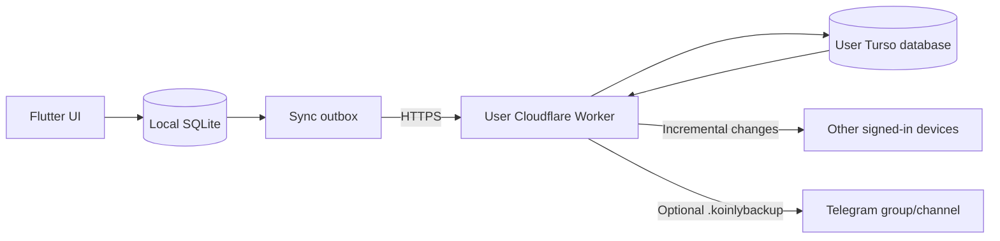

<p align="center">
  
</p>

# Koinly

<p align="center">
  <a href="https://flutter.dev"></a>
  <a href="https://github.com/Chowdhury-Siam/Koinly/actions/workflows/build-android-apks.yml"></a>
  
  <a href="LICENSE"></a>
</p>

<p align="center">
  A local-first personal finance tracker for Android and Windows with optional self-hosted multi-device synchronization.
</p>

## Overview

Koinly stores finance data in local SQLite first. Accounts, transactions,
budgets, categories, loans, purchase plans, reports, and backups continue to
work without an internet connection.

Online synchronization is optional and self-hosted. Users deploy their own
Cloudflare Worker backed by their own Turso database, then enter that Worker URL
inside **Settings > Account & sync**. Turso credentials and the Worker JWT secret
stay on the Worker and are never embedded in the app.

## Features

### Personal finance

- Multiple cash, bank, card, savings, and custom accounts
- Income, expense, and transfer transactions
- Single-date transactions or optional start/end date ranges
- Single-time transactions or optional start/end time ranges
- Custom income and expense categories
- Monthly budgets and progress tracking
- Lending and borrowing with contacts, repayments, interest, due dates, and timestamps
- Purchase planning with item name, expected price, category, total planned cost, editing, and one-tap purchase conversion
- Cash-flow trends, category analysis, balances, and net results
- Search plus account/category/type/date filters
- Quick account/category creation directly from transaction pickers

### Data and backups

- Local-first SQLite database
- Encrypted `.koinlybackup` files
- Merge-based backup restore: existing local records are preserved and matching data is reconciled instead of duplicated
- Restore-or-Start-New onboarding flow
- Starter accounts are created only when starting a new profile
- Automatic local backups with daily, weekly, or monthly schedules
- User-selected `Koinly/Backup` folder on Android using persistent Storage Access Framework permission
- Optional deletion of the previous automatic backup after a new one succeeds
- Internal safety backups before high-risk local data changes
- Automatic category deduplication during restore and sync
- Privacy-safe diagnostics under **Advanced settings > Data health**

### App experience

- Material 3 interface
- Light, dark, and system themes
- Android and Windows layouts
- Spring-based press feedback and restrained elastic UI motion
- Touch-friendly keyboard focus behavior: tapping outside any text field releases that field, so numeric/text keyboards do not remain stuck over pickers and actions
- Profile image/GIF/short-video media with non-destructive repositioning, crop framing, and zoom
- Android reminders
- GitHub Releases update checks
- Architecture-specific Android APK support and Windows installer releases

### Self-hosted sync

- Cloudflare Worker + Turso
- First-owner registration on a fresh Worker
- Login from additional devices with the same account
- Local outbox for offline edits
- Incremental pull/push synchronization
- Merge-first **Restore cloud copy** and **Upload local changes** behavior
- Category deduplication across devices
- Version-based conflict handling and convergence tracking
- Optional Telegram `.koinlybackup` delivery from the Worker

## Architecture



Local SQLite is the primary write target. When self-hosted sync is configured,
Koinly queues entity operations locally, pushes them to the authenticated
Worker, and pulls remote changes using a server cursor.

## Supported release targets

| Platform | Output |
| --- | --- |
| Android | Universal APK, ARM32 APK, ARM64 APK |
| Windows x64 | Inno Setup installer |

## Quick start

### Requirements

- Flutter with Dart `>=3.5.0 <4.0.0`
- Android Studio / Android SDK 36 / Java 17 for Android builds
- Visual Studio with **Desktop development with C++** for Windows builds
- Node.js 22 for Worker development

### Run locally

```bash
git clone https://github.com/Chowdhury-Siam/Koinly.git
cd Koinly
flutter pub get
flutter run
```

Choose a target when needed:

```bash
flutter run -d android
flutter run -d windows
```

A Worker is not required for offline/local-only use.

## Build the app

The app does not require a sync URL at build time. Each user enters their own
self-hosted Worker URL at runtime.

### Android

```bash
flutter build apk --release \
  --no-tree-shake-icons \
  --dart-define=KOINLY_APP_VERSION=1.0.1076
```

### Windows

```bash
flutter build windows --release \
  --dart-define=KOINLY_APP_VERSION=1.0.1076
```

`KOINLY_APP_VERSION` is optional for local development. The release workflow
sets the build name and number from `pubspec.yaml`.

## Self-hosted cloud sync

Open **Settings > Account & sync** in Koinly. The screen contains one sync
configuration: **Self-hosted Sync Worker**.

The Worker URL must be an HTTPS origin such as:

```text
https://my-koinly-sync.<account-subdomain>.workers.dev
```

Koinly validates that:

- the URL uses HTTPS and has no path/query/fragment;
- `GET /health` identifies the service as `koinly-sync`;
- required Worker secrets are configured;
- Turso is reachable;
- the schema is ready; and
- registration mode is `first-user`.

After validation, create the first owner account on a fresh Worker. Registration
then closes. Other devices use **Login** with that same account.

### Deploy with GitHub Actions

The standard deployment flow is:

```text
Fork Koinly
  -> create Turso database
  -> configure GitHub Actions values
  -> run Deploy Self-Hosted Sync Worker
  -> copy the workers.dev URL
  -> validate the URL in Koinly
  -> create the first owner account
```

### 1. Create a Turso database

Install and authenticate the Turso CLI, then run:

```bash
turso db create koinly-sync
turso db show koinly-sync --url
turso db tokens create koinly-sync
```

Keep the `libsql://...turso.io` database URL and token.

### 2. Create a Cloudflare API token

Create a Cloudflare token based on **Edit Cloudflare Workers**. It needs access
to the Cloudflare account that will host the Worker.

The account must have a `workers.dev` subdomain enabled.

### 3. Add GitHub Actions configuration

In the fork, open:

**Settings > Secrets and variables > Actions**

Add:

| Name | Store as | Purpose |
| --- | --- | --- |
| `CLOUDFLARE_NAME_U` | Secret or variable | Worker name, for example `my-koinly-sync` |
| `CLOUDFLARE_API_TOKEN_U` | Secret | Deploys the Worker |
| `CLOUDFLARE_ACCOUNT_ID_U` | Secret | Cloudflare account ID |
| `TURSO_DATABASE_URL_U` | Secret | `libsql://...turso.io` database URL |
| `TURSO_AUTH_TOKEN_U` | Secret | Turso database token |
| `JWT_SECRET_U` | Secret | Signs sessions and protects encrypted Worker-side secrets |

`JWT_SECRET_U` must contain at least 32 characters. Generate one with:

```bash
openssl rand -hex 32
```

Never commit real credentials to workflow files, Wrangler configuration, source
code, screenshots, or logs.

### 4. Deploy

Open **Actions > Deploy Self-Hosted Sync Worker > Run workflow**.

The workflow:

1. installs Worker dependencies;
2. runs TypeScript checks and tests;
3. applies the Turso schema;
4. uploads Worker secrets;
5. deploys with `wrangler.self-hosted.toml`;
6. reads the exact public Worker URL from Wrangler; and
7. verifies `/health` including Telegram-backup capability.

Copy the Worker URL printed in the workflow summary.

### 5. Connect Koinly

In Koinly:

1. Open **Settings > Account & sync**.
2. Enter the Cloudflare Worker URL.
3. Tap **Validate and use Worker**.
4. Create the first account if the Worker is new, or log in if it already has an owner account.
5. Use the same Worker URL and account on additional devices.

Changing the configured Worker signs out the current sync account but does not
delete local finance data.

### Sync behavior

**Upload local changes** reconciles the full local snapshot with the Worker, not
only the current pending outbox. **Restore cloud copy** downloads the full cloud
state and merges it with the device. Both operations preserve local-only and
cloud-only records, reconcile matching stable IDs, and semantically deduplicate
equivalent categories.

## Optional Telegram cloud backup

When a self-hosted Worker is validated and the user is signed in, the bot icon
in the upper-right of **Account & sync** opens **Telegram backup**.

Users can configure:

- Telegram bot token
- Group or channel Chat ID
- Daily, weekly, or monthly schedule
- Exact delivery time
- Test delivery
- Manual **Upload backup now**

The bot token is sent only to the authenticated user's Worker. The Worker
encrypts it with AES-GCM using key material derived from `JWT_SECRET` before
storing it in Turso. The plaintext saved token is never returned to the app.

The Worker Cron Trigger checks every five minutes. Before a manual backup or
when enabling the schedule, Koinly performs a full cloud reconciliation so the
Worker snapshot contains the current local finance data. The Worker refuses to
send an empty finance backup.

For channels, add the bot as an administrator with permission to post messages.

## Automatic local backup

Open **Settings > Advanced settings > Automatic local backup**.

Users can choose:

- Daily, weekly, or monthly backup frequency
- Backup time
- Weekly day or monthly date when applicable
- A destination folder
- Whether older automatic backups are deleted after a new one is saved

On Android, folder selection uses the system Storage Access Framework. Koinly
uses/creates a `Koinly/Backup` destination under the selected location and keeps
the persisted folder grant for scheduled backups.

## GitHub Actions

| Workflow | Purpose |
| --- | --- |
| `build-android-apks.yml` | Tests/builds Android APKs and Windows release artifacts |
| `deploy-sync-worker.yml` | Deploys the fork owner's self-hosted Cloudflare Worker |

The app build workflow does not need a Worker URL or Turso credential.

### Android signing

Release APK builds expect a permanent signing key through repository secrets.
Keep the keystore and passwords out of the repository. The workflow validates
the configured keystore before building release artifacts.

### Windows signing

Windows code signing is optional. If no signing certificate is configured, the
installer is still generated but Windows SmartScreen may warn users about an
unrecognized publisher.

## Worker development

```bash
cd cloud/worker
npm ci
npm run typecheck
npm test
```

Apply the schema using environment variables:

```bash
export TURSO_DATABASE_URL='libsql://your-db.turso.io'
export TURSO_AUTH_TOKEN='your-token'
npm run schema:apply
```

Deploy manually:

```bash
wrangler secret put TURSO_DATABASE_URL
wrangler secret put TURSO_AUTH_TOKEN
wrangler secret put JWT_SECRET
npx wrangler deploy --config wrangler.self-hosted.toml --name my-koinly-sync
```

See [`cloud/worker/README.md`](cloud/worker/README.md) for Worker-specific API
and troubleshooting details.

## Data safety and security

- Finance writes are local-first.
- Sync access and refresh tokens use platform secure storage.
- Turso credentials and `JWT_SECRET` remain Worker-side.
- Self-hosted Worker queries are scoped to the authenticated user.
- Sync operations are idempotent and versioned.
- Local/cloud restore behavior is merge-based.
- Backup imports perform category reconciliation to prevent common semantic duplicates.
- Telegram bot tokens saved for Worker backup delivery are encrypted before Turso storage.
- Profile media remains device-local and is excluded from finance synchronization.

## Testing

Run Flutter tests:

```bash
flutter test
```

Run Worker checks:

```bash
cd cloud/worker
npm ci
npm run typecheck
npm test
```

The repository also contains source-contract regression tests for onboarding,
backup merging, sync convergence, Telegram backups, transaction ranges,
purchase planning, elastic motion, picker quick-add actions, and keyboard focus
dismissal.

## Troubleshooting

### Worker validation fails

Open:

```text
https://<worker-name>.<account-subdomain>.workers.dev/health
```

A ready Worker reports `ok: true`, `service: "koinly-sync"`,
`databaseReachable: true`, `schemaReady: true`, and
`registrationMode: "first-user"`.

### Cloudflare error 1042

Confirm `TURSO_DATABASE_URL_U` is the `libsql://*.turso.io` URL from Turso, not
a `workers.dev` URL. Also remove any same-account Worker proxy route that loops
back into the Koinly Worker.

### Cannot create another account

A fresh self-hosted Worker accepts one owner registration. After that, use
**Login** with the original account on additional devices.

### Telegram backup is empty or fails

Update and redeploy the Worker, then use **Upload local changes** once before
creating a Telegram backup. Current Workers reject empty finance backups rather
than sending a misleading file.

### Android folder backup fails

Open **Automatic local backup**, choose the destination again with the Android
system folder picker, then save the backup settings. This renews the persistent
Storage Access Framework grant.

## Project structure

```text
Koinly/
├── lib/                         # Flutter application, storage, sync and UI
├── lib/loans/                   # Lending/borrowing domain
├── lib/profile/                 # Profile media handling and UI
├── android/                     # Android runner and platform integration
├── windows/                     # Windows runner
├── cloud/worker/                # Self-hosted Cloudflare Worker + Turso schema
├── test/                        # Flutter/unit/source-contract tests
├── .github/workflows/
│   ├── build-android-apks.yml
│   └── deploy-sync-worker.yml
├── pubspec.yaml
└── README.md
```

## License

Licensed under the Apache License 2.0. See [`LICENSE`](LICENSE).
